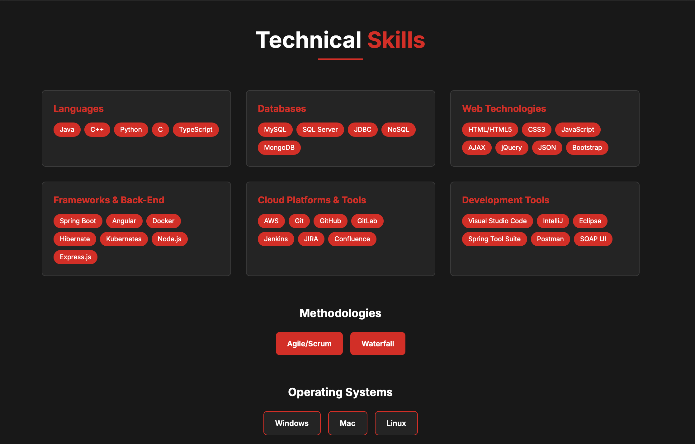

# Pradeep Gatti - Data Analyst Portfolio

Welcome to the GitHub repository of Pradeep Gatti's portfolio website. This site serves as a comprehensive overview of Pradeep's skills, experiences, and work in the field of data analytics.

## Table of Contents

- [About](#about)
- [Features](#features)
- [Tech Stack](#tech-stack)
- [Portfolio Sections](#portfolio-sections)
- [Setup and Usage](#setup-and-usage)
- [Contribution](#contribution)
- [Contact](#contact)

## About

This project is a modern, responsive portfolio website for Pradeep Gatti, a dedicated data analyst with 4.5+ years of experience. The website showcases professional skills, work experience, and projects in an elegant Netflix-inspired dark theme.

## Features

- **Modern Design:** Netflix-inspired dark theme with red accents and smooth animations
- **Responsive Layout:** Fully responsive design that works on all devices
- **Interactive Elements:** Smooth scrolling, hover effects, and Framer Motion animations
- **Professional Sections:** Comprehensive coverage of skills, experience, and projects
- **Contact Integration:** Functional contact form and social media links
- **3D Elements:** Interactive 3D data visualization using Three.js

## Tech Stack

This website is built with modern technologies:

- **Frontend:** React 19 with TypeScript
- **Build Tool:** Vite for fast development and optimized builds
- **Styling:** Tailwind CSS with custom Netflix theme
- **Animations:** Framer Motion for smooth transitions
- **3D Graphics:** Three.js with React Three Fiber
- **Deployment:** Render (Static Site)

## Portfolio Sections

### 🏠 Hero Section
- **Main Headline:** "PRADEEP GATTI" in large, bold typography
- **Professional Title:** "Data Analyst | Transforming Data into Actionable Insights"
- **Summary:** Brief professional description highlighting 4.5+ years of experience
- **Call-to-Action:** "View My Work" and "Download Resume" buttons
- **Background:** Subtle 3D data visualization with animated elements

### 👨‍💼 About Me Section
- **Professional Summary:** Comprehensive overview of data analysis expertise
- **Key Skills:** SQL, Python, Tableau, Excel, ETL pipelines, AWS
- **Education:** 
  - Master of Science in Information Systems (Stevens Institute of Technology, USA)
  - B. Tech in Information Technology (Sree Vidyanikethan Engineering College, India)
- **Achievements:** Tableau Specialist certification and measurable impact metrics

### 💼 Professional Experience
- **Timeline Design:** Vertical timeline with red accent line
- **Current Role:** Data Analyst at Broad Peak Systems (Remote)
- **Previous Experience:** Data Engineer at Cognizant Technology Solutions
- **Key Achievements:** 60% data processing time reduction, 20% sales forecasting improvement
- **Technologies:** Python, SQL, Tableau, AWS, Git, Agile methodologies

### 🛠️ Technical Skills
- **Programming Languages:** Java, C++, Python, C, TypeScript
- **Databases:** MySQL, SQL Server, MongoDB, NoSQL
- **Web Technologies:** HTML5, CSS3, JavaScript, React, Angular
- **Cloud & Tools:** AWS, Git, GitHub, Jenkins, JIRA, Docker
- **Methodologies:** Agile/Scrum, Waterfall
- **Operating Systems:** Windows, Mac, Linux

### 📊 Projects & Certifications
- **Featured Projects:**
  - Illegal Drone Tracking (Python, Pandas, GeoPandas)
  - MindWell Health Application (SQL, Python, Tableau)
  - Customer Segmentation KMeans (Python, Jupyter, scikit-learn)
- **Certifications:** Tableau Desktop Specialist, PMP, Java Developer

### 📞 Contact Section
- **Contact Form:** Functional form with name, email, and message fields
- **Contact Information:** Phone (+1 682-283-9478) and email (gpradeep7898@gmail.com)
- **Social Links:** Email, LinkedIn, GitHub, Portfolio links
- **Professional Summary:** Invitation for collaborations and opportunities

## Portfolio Screenshots

### Hero Section

*Clean, modern hero section with animated 3D elements and professional introduction*

### About Me Section

*Professional summary and education details in a two-column layout*

### Experience Timeline

*Professional experience displayed in an elegant timeline format*

### Technical Skills

*Comprehensive technical skills organized by category*

### Contact Section

*Contact form and social media links for easy communication*

## Setup and Usage

To run this project locally:

1. **Clone the repository:**
```bash
git clone https://github.com/gpradeep7898/Personal-Portfolio
```

2. **Install dependencies:**
```bash
npm install
```

3. **Start the development server:**
```bash
npm run dev
```

4. **Open your browser and navigate to the local URL (usually http://localhost:5173)**

## Live Demo

Visit the live portfolio: [https://personal-portfolio-yojj.onrender.com](https://personal-portfolio-yojj.onrender.com)

## Contribution

If you want to contribute to this project, feel free to submit a pull request. Any contributions, big or small, are greatly appreciated.

## Contact

You can reach out to Pradeep via:

- **Email:** gpradeep7898@gmail.com
- **Phone:** +1 (682) 283-9478
- **LinkedIn:** [linkedin.com/in/gatti-pradeep7898](https://linkedin.com/in/gatti-pradeep7898)
- **GitHub:** [github.com/gpradeep7898](https://github.com/gpradeep7898)

---

Feel free to explore the website to gain a comprehensive understanding of Pradeep's work, capabilities, and achievements in the field of data analytics.
